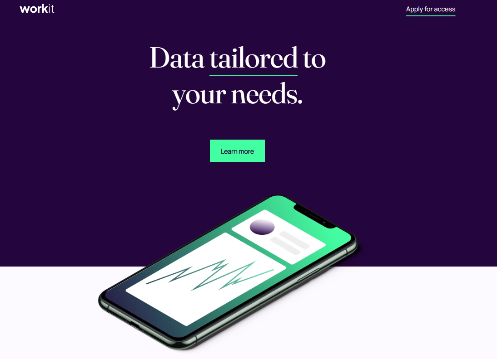
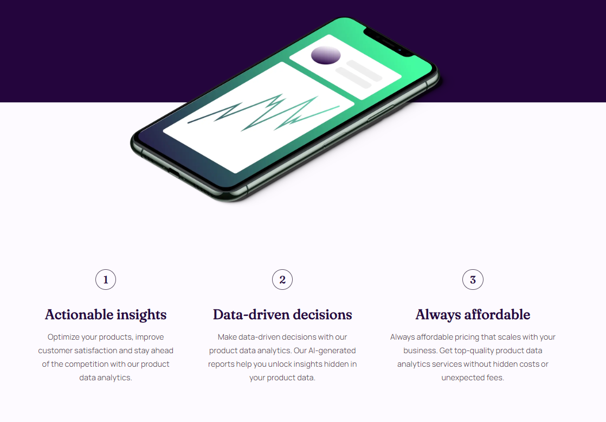
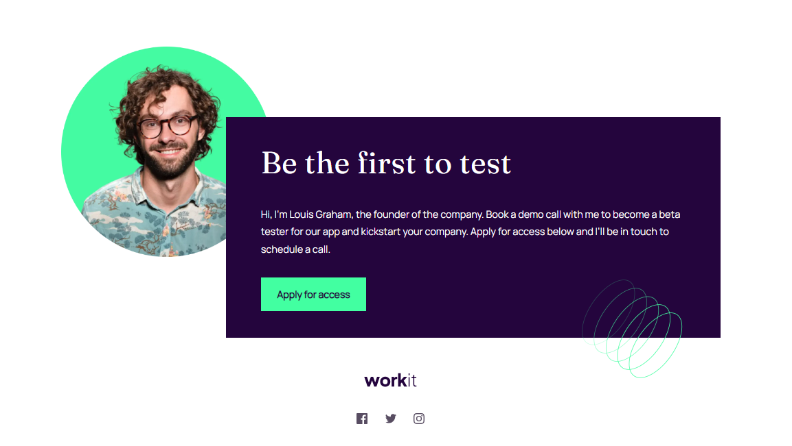

# Frontend Mentor - Workit landing page solution

This is my solution to the [Workit landing page challenge on Frontend Mentor](https://www.frontendmentor.io/challenges/workit-landing-page-2fYnyle5lu).

## Table of contents

- [Overview](#overview)
  - [Links](#links)
- [My process](#my-process)
  - [Continued development](#continued-development)
  - [Built with](#built-with)
- [Screenshot](#screenshot)

## Overview

Project is simple landing page built with mobile first approach that focus on accessibility. 

### Links

- Live Site URL: [Workit page URL](r3tr00o.github.io/workit-landing-page/)

## My process

Main goal of this projects was to practice semantic and accessible HTML and new CSS features. 
I started with mobile first approach to reduce media queries to minimum. I tried use as many new CSS features as possible to optimze it, 
but `style.css` still need restructurization and I'm working on it.

### Continued development

- [x] Take care of whole structure of the project on github.
- [ ] Make page as much accessible as possible.
- [ ] Restructure a `style.css` into two files.

### Built with

- HTML
- CSS

### Screenshot

